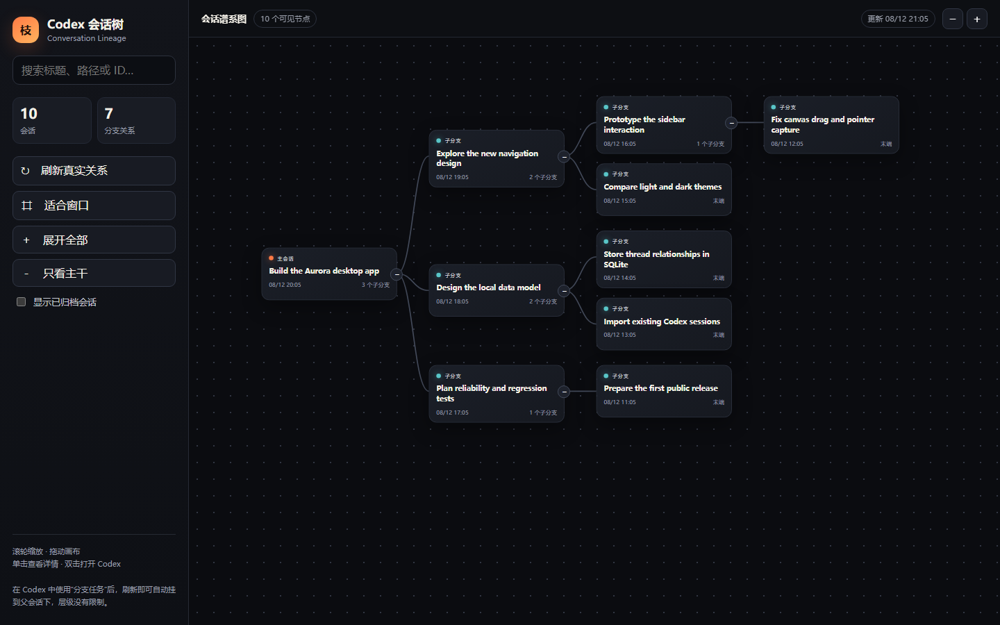
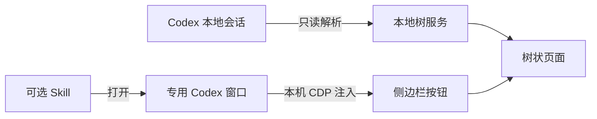

# Codex Conversation Tree

[](#系统要求)
[](#隐私与安全)
[](LICENSE)

把 Codex 任务按真实的父子关系画成一棵可以无限分叉的树，并直接放进 Codex 的主工作区。

> 非 OpenAI 官方项目。目前 Codex 插件没有公开的侧边栏 UI 扩展接口，所以项目通过本机 CDP 桥接实现侧边栏按钮和内嵌页面。



[English](README.en.md) · [安装](#安装只需三步) · [与类似项目的区别](#github-上有没有类似项目)

## 它能做什么

- 根据 Codex 本地会话中的 `forked_from_id` 读取真实分支关系，不靠标题猜测。
- 在左侧 **Plugins** 下方显示 **Conversation Tree** 按钮。
- 在对话区域显示可缩放、拖动、折叠、搜索的无限树状视图。
- 点击节点直接打开对应 Codex 任务。
- 只读运行，不修改任务内容；所有数据留在本机。
- 修复拖动画布后鼠标“黏住”的问题，并处理窗口失焦、指针取消等边界情况。


## 安装：只需三步

1. 在 GitHub 页面点击 **Code → Download ZIP**。
2. 解压后双击 **`install.cmd`**。
3. 使用桌面的 **Codex Conversation Tree** 快捷方式启动；首次打开独立 Codex 窗口时，按提示登录一次。

安装器会把程序放到 `%LOCALAPPDATA%\CodexConversationTree`，从 Node.js 官网下载并校验便携运行时，同时注册可选的 Codex Skill。无需安装 npm 依赖，也无需管理员权限。

如果 Windows 阻止脚本，可在仓库目录运行：

```powershell
powershell -NoProfile -ExecutionPolicy Bypass -File .\install.ps1
```

卸载时双击 **`uninstall.cmd`**。它只删除本项目的程序、快捷方式和插件记录。

## 怎么使用

1. 从桌面快捷方式启动专用 Codex 窗口。
2. 点击左侧 **Conversation Tree**。
3. 滚轮缩放，拖动空白处平移；拖动节点调整布局。
4. 点击节点标题打开任务；用搜索框快速定位任务。

### 插件、Skill 和运行程序是什么关系？

核心功能由本地运行程序提供；插件包只是把 Skill 注册到 Codex，让你可以说“打开会话树”。二者不需要同时操作：桌面快捷方式本身就能完整使用，Skill 是额外入口。



## 为什么不是普通的“一键装插件”？

Codex 插件可以提供 Skills、MCP、Apps 等能力，但目前没有公开的接口允许第三方直接向桌面端侧边栏添加按钮。因此，“安装器 + 专用 Codex 窗口”是当前最简单、又不会干扰普通 Codex 窗口的方案。代价是：Codex 更新后，界面选择器可能需要跟随调整；专用窗口首次使用可能需要单独登录。

## GitHub 上有没有类似项目？

有，但定位不完全相同。本项目不宣称首创。

| 项目 | 形式 | 与本项目的主要区别 |
|---|---|---|
| [Agentree](https://github.com/serban-cercelescu/Agentree) | 独立桌面应用 | 支持多种 coding agent、消息级分叉；不嵌入 Codex Desktop |
| [Codex Conversation Map](https://github.com/Atman-Angle/Codex-Conversation-Map) | Skill + Obsidian Canvas/tldraw | 生成语义协作地图，不是 Codex 任务的真实父子谱系 |
| [CodexMonitor 的 ChatTree 分支](https://github.com/Reekin/CodexMonitor/tree/feat/chattree-integration) | 外部监控工具中的树 | 集成在 CodexMonitor，而不是 Codex Desktop 侧边栏和对话区 |

OpenAI Codex 仓库中也有[树状会话管理的功能建议](https://github.com/openai/codex/issues/12450)。Codex App Server 已公开 `parentThreadId`、`ancestorThreadId` 和 `thread/fork` 等关系能力；本项目当前从本地会话元数据读取 `forked_from_id`。

本项目的重点是：**Windows Codex Desktop、真实任务谱系、左侧入口、主工作区内嵌、点击原生打开、完全本地只读**。

## 系统要求

- Windows 10/11 x64
- 已安装官方 Codex Windows 应用
- 安装时可访问 `nodejs.org`（仅下载已校验的便携 Node.js 运行时）

## 隐私与安全

- 树数据只从本机 Codex 会话目录读取，不上传到第三方服务。
- 本地服务默认只监听 `127.0.0.1:47831`。
- 查看器为只读；打开节点只会导航到相应 Codex 任务。
- 专用 Codex 窗口启用本机调试端口以完成界面注入。不要把端口暴露到局域网或公网。

详见 [SECURITY.md](SECURITY.md)。

## 开发与反馈

核心没有 npm 依赖。修改后可运行：

```powershell
node --check app/server.js
node --check app/inject.js
node --check app/embedded-launcher.js
```

欢迎提交 Issue 和 Pull Request。开发说明见 [CONTRIBUTING.md](CONTRIBUTING.md)，版本记录见 [CHANGELOG.md](CHANGELOG.md)。

## License

[MIT](LICENSE)
